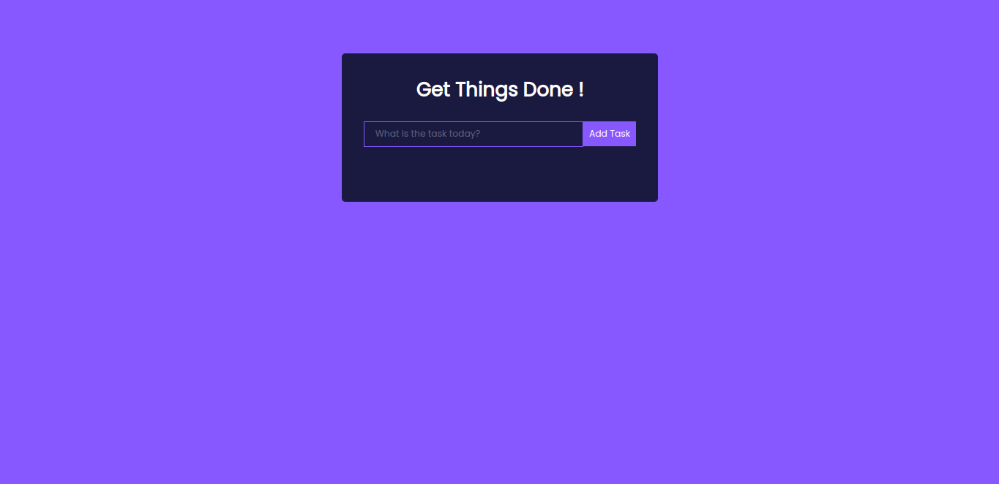
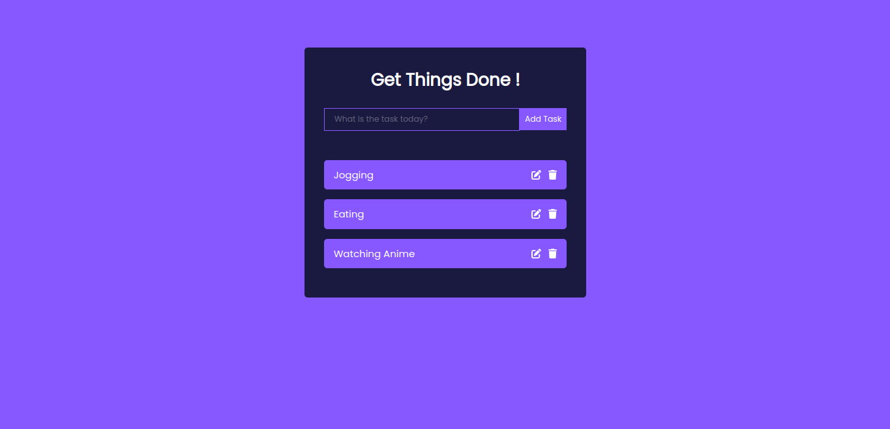
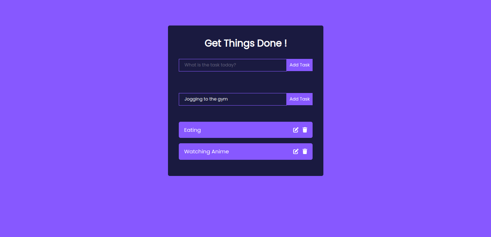

# Todo List React App
---
### by Atiloye, Adu.

This is a todo app made using React JS framework. It allows users to add, edit and delete tasks that have been inputted.

## Screenshots

## GitHub Repository and Live Deployment Link
- [GitHub Repo](https://github.com/Atiloye/todolist-app-react)
- [Live Link](https://todolist-7j73atlo5-atiloye-adus-projects.vercel.app/)

## Bugs
- If any bugs or glitches are found, please send me an email on hartiloye2002@outlook.com

## Resources:
- I used a MDN and a youtube tutorial for the project: 
Youtube link:[YT Tutorial Link](https://www.youtube.com/watch?v=LoYbN6qoQHA)
MDN Link:[MDN Todo Link](https://developer.mozilla.org/en-US/docs/Learn/Tools_and_testing/Client-side_JavaScript_frameworks/React_todo_list_beginning)
- FortAwesome [Icons and Fonts](https://docs.fontawesome.com/v5/web/use-with/react)
- React Js Framework
- Javascript
- CSS
